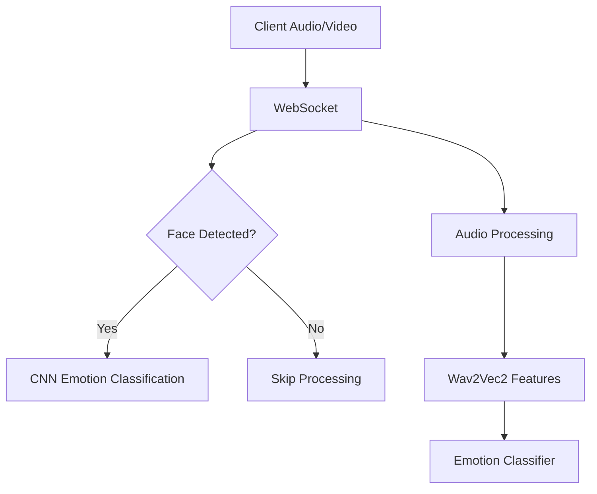

# EmotionScan Backend


The backend server for real-time emotion recognition processing.

## Features
- Facial emotion detection using CNN + Haar Cascade
- Speech emotion analysis via:
  - Hugging Face API (primary)
  - Local Wav2Vec2 model (fallback)
- WebSocket communication with frontend
- Multi-model load balancing

## Installation

1. **Clone Repository**
```bash
git clone https://github.com/VinamraSaurav/backend-emotion-recognition
cd backend-emotion-recognition
```

2. **Set Up Virtual Environment**
```bash
python -m venv venv
source venv/bin/activate  # Linux/MacOS
.\venv\Scripts\activate   # Windows
```

3. **Install Dependencies**
```bash
pip install -r requirements.txt
```

4. **Download Models**
```bash
python model.py
```
This will download:
- Wav2Vec2 base model (~300MB)
- Custom emotion classifier weights
- Save to `./saved_models/`

## Configuration
Create `.env` file:
```ini
API_KEY=your_huggingface_key  # Optional
PORT=5000
CUDA_VISIBLE_DEVICES=-1       # Disable GPU if needed
```

## Running the Server
```bash
python backend.py
```
Server starts at `http://localhost:5000`

## API Endpoints
| Endpoint | Method | Description |
|----------|--------|-------------|
| `/health` | GET | Service status |
| Socket.IO | WS | Real-time data pipeline |

## Model Architecture


## Troubleshooting
- **Model Loading Issues**: Verify `saved_models/` contains:
  - `config.json`
  - `pytorch_model.bin`
  - `preprocessor_config.json`
- **Audio Errors**: Check sample rate = 16kHz

